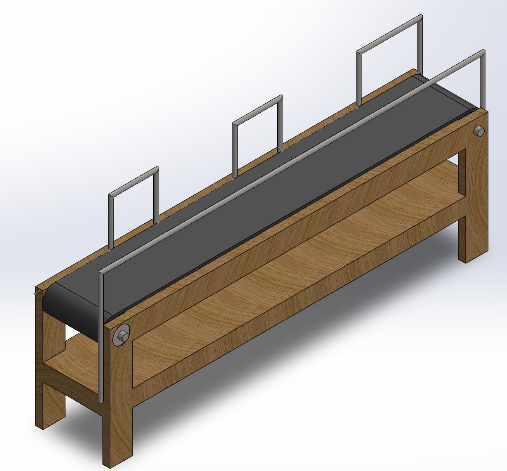
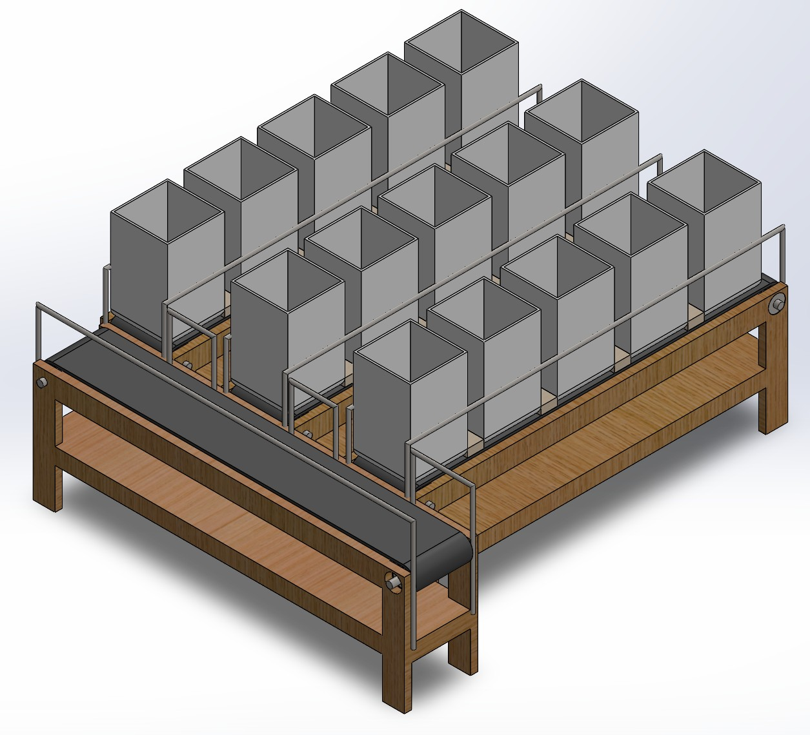
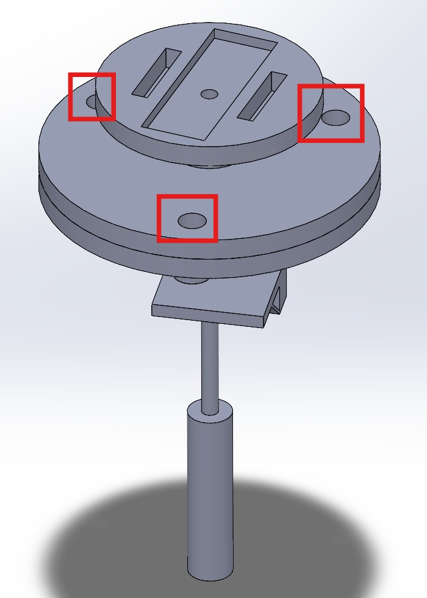
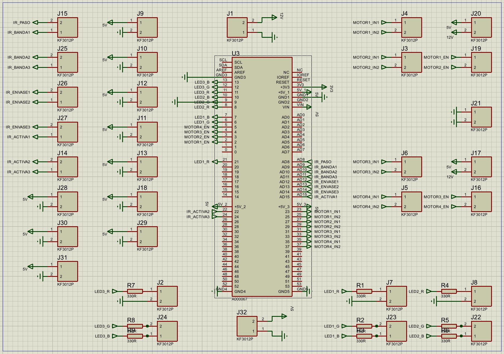
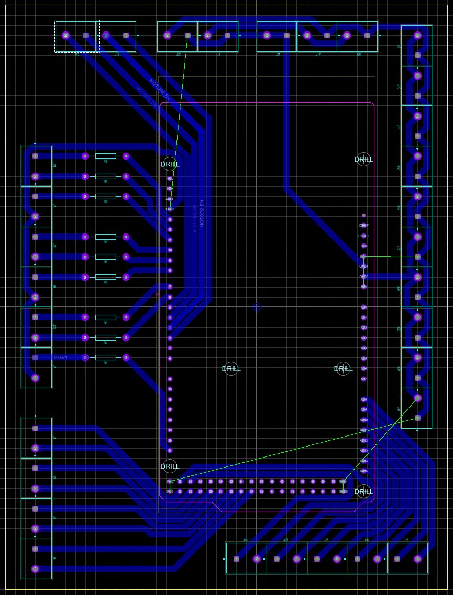
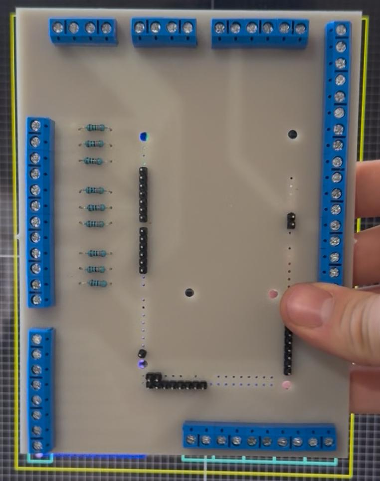
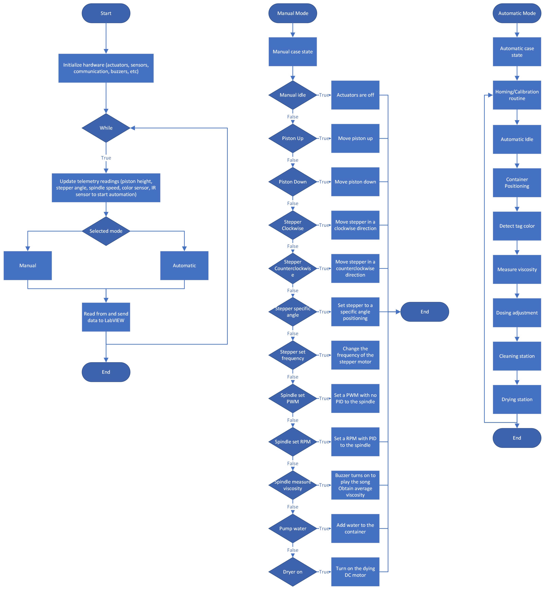

# Challenge - Viscometer and Conveyor Belt
This repository contains my contributions to the 5th semester project, along with the final technical report submitted to the supervising professors, which documents the design, implementation, and results of the work.

The project was about designing and implementing a mechatronic system combining a viscometer and a conveyor belt with three stations (stacking, measuring, sorting). The goal was to automate viscosity measurement and integrate it into a conveyor belt using microcontrollers and PLCs

The project lasted 15 weeks:
- Weeks 1-5: Project planning, research, and first draft design
- Weeks 6-10: CAD design, manufacturing, electronics design, manual control programming, and manual UI design
- Weeks 11-15: Adjustments, automatic control implementation, PCB design, full programming (manual + automatic), PLC integration.

> Note: For a complete review of the whole Challenge, please review the document `Challenge_Final__5to_Semestre` document, also included in this Repo

Main contributions:
- **Viscometer**: Full programming, LabVIEW UI design
- **Conveyor Belt**: Stack system logic design, CAD design for stack system and conveyor belt, complete electronics
- **Control**: Collaborated in implementing modularized code structure and tuning with MATLAB
- **Integration**: Connected UI with the viscometer, achieved manual measurement and visualization

Minor contributions:
- **Viscometer**: CAD corrections, assisted electronics integration and testing

---

## Repository Structure
├── Conveyor Belt CAD/                 → CAD Screenshots and Technical Drawings

├── Viscometer CAD/                    → CAD corrections and design adjustments

├── Electronics/                       → Schematics, PCB Design, and Final Assembly

├── Programming/

│   ├── Tests/                         → Tests made for each component 

│   ├── Manual Programming/            → Manual control code

│   ├── Full Programming/              → Manual + Automatic control code

│   ├── Libraries                      → Libraries created by me

├── User Interface/                    → Backend and Frontend design

├── Challenge_Final__5to_Semestre.pdf  → Final Technical Report

├── LICENSE

├── README.md

---

## Mechanics
- **Software Used**: SolidWorks
- Designed the CAD and technical drawings of the conveyor belt and stack system for manufacturing.
- Helped correct some problems on the final CAD design of the viscometer.

### Conveyor Belt CAD

> Note: The technical drawings can be found in the Conveyor Belt CAD folder

### Stack System CAD

### Stack System Results (Manufacturing)

### Viscometer CAD

### Discussions and Lessons Learned
- **CAD as a critical step:** Initially, some team members considered skipping detailed CAD design, but this led to imprecise manufacturing and rework. I learned that CAD is not just a draft but a fundamental tool to ensure accuracy and reproducibility in mechatronic projects.
- **Use of commercial dimensions:** We attempted to manufacture custom-sized parts, which resulted in poor precision and assembly issues. The lesson was clear: using standard commercial dimensions and components is more reliable, cost-effective, and ensures compatibility during integration.
- **Engineering takeaway:** Proper CAD design combined with standard materials reduces risk, saves time, and improves the quality of the final prototype.

---

## Electronics
- **Software Used**: Proteus 9 Professional
- Designed the full electronics design (schematics, PCB design, assembly) of the Stack System.
- Assisted in the electronics integration of the Viscometer.

### Stack System Schematics

### Stack System PCB Design

### Results (Final Assembly)

### Discussions and Lessons Learned
- **The importance of PCB design:** Initially, the system relied on numerous cables, which made integration complex and error‑prone. Designing and implementing PCBs allowed us to reduce wiring, improve reliability, and achieve a cleaner assembly.
- **First experience with PCB development:** As this was our first time working with PCB layouts, we expected difficulties. However, the design process was successful, and no major errors were found in the individual boards.
- **Integration challenges:** Some issues arose during final system integration, mainly due to miscommunication within the team and connection errors between subsystems. These problems were not caused by the PCB design itself, but highlighted the importance of clear documentation and coordination across different areas.
- **Engineering takeaway:** PCB design is essential for robust mechatronic systems. It minimizes wiring complexity, reduces noise, and ensures long‑term reliability compared to protoboards or temporary connections.

---

## Programming
- **Language**: C++
- **Software**: VS Code, PlatformIO IDE
- **Microcontroller**: ESP32
- Refactored the manual programming by modularizing and creating classes for each component.
- Designed the full programming by adding the automatic programming logic to the existing manual code
- Performed individual tests for each component to ensure full functioning
- Changed the spindle feedback from analog to digital by applying PID control and using a MATLAB script to tune the PID parameters

> Note: The test, manual, and full programming codes are included in the Programming folder. Please review the folder for further information
> The folder includes the implementation (`src/main.cpp`), configuration (`src/definitions.h`), and libraries created by me. The external libraries provided by the professor are not included due to licensing. 

### Programming Flow Diagram

The following flowchart illustrates the operational logic of the viscometer system, which supports both manual and automatic modes. It includes initialization routines, telemetry updates, and decision-making based on user input or automated sequences.

- **Manual Mode:** Allows direct control of actuators and sensors via LabVIEW, including piston movement, stepper positioning, spindle speed control, and water dosing.
- **Automatic Mode:** Executes a predefined sequence including homing, container positioning, tag detection, viscosity measurement, dosing adjustment, cleaning, and drying.

> This diagram reflects the modularized structure implemented in the final code, separating manual and automatic logic for clarity and scalability.

### Discussions and Lessons Learned
- **The importance of modularizing code:** The initial version of the program was not modularized, resulting in more than 900 lines within a single `main.cpp` file. This made troubleshooting difficult, slowed down development, and reduced readability.
- **Time lost due to refactoring:** Because the code was not modularized from the beginning, we spent an entire week redesigning and restructuring it. This delay impacted our ability to deliver the manual programming and UI on time, affecting one of the evaluation scores.
- **LabVIEW integration benefits from modularization:** Once the code was separated into classes for each component, connecting and controlling them through LabVIEW became straightforward, enabling successful manual monitoring and control of the viscometer.
- **Hardware limitations affected automation:** The full programming (manual + automatic) could not be validated because we used only one ESP32. All available pins were consumed by manual control, leaving no capacity for automatic routines or PLC integration. This was an electronic limitation, not a logic issue.

---

## User Interface
- **Software Used**: LabVIEW
- Designed and implemented the HMI (Human-Machine Interface) to monitor sensor data, control actuators in manual mode, and enable switching between manual and automatic modes.
- Developed both backend logic (data acquisition and processing) and frontend visualization (buttons, indicators, graphs).
- Integrated telemetry readings (piston height, spindle RPM, viscosity values) with real-time feedback.

### Backend Screenshot

### Frontend Screenshot

### Discussions and Lessons Learned
- **UI as a bridge between hardware and user:** LabVIEW allowed us to visualize sensor data and control actuators without needing to interact directly with the microcontroller code. This made the system more accessible and easier to test.
- **Balancing functionality and design:** Developing a UI that was both technically functional and visually appealing required more time than expected. Achieving this balance taught me that usability and aesthetics are equally important in engineering interfaces.
- **Learning curve with LabVIEW:** Although LabVIEW was new to me, building both backend logic and frontend visualization strengthened my understanding of data acquisition systems and HMI design. The initial learning curve was steep, but once mastered, it accelerated development.
- **Value of early UI integration:** Testing the UI in parallel with programming would have saved time and improved usability. I learned that integrating the interface early in the project helps identify issues before final assembly.

---
## Final Results
- Viscometer full integration.
*(Incluir video de viscosimetro con UI)*

- Full system integration.
*(Incluir foto de la integración de PLC con microcontrolador, sistema completo)*

---

## Final Reflections
- **Coordination and contingency planning:** Although we scheduled a full week for final testing and integration, unforeseen circumstances disrupted the plan. The team member responsible for PLC programming was hospitalized due to stress, and no one else was familiar with that subsystem. This highlighted the risk of depending on a single person for a critical area.
- **Underestimating automation complexity:** While the viscometer programming did not depend on one person, I was the only member capable of implementing the required modularized code. I underestimated the time needed to design and test the automatic routines, which limited our ability to validate the full system.
- **Late realization of hardware needs:** Coordination issues with the PLC team led to last‑minute requests for additional pins, which the single ESP32 could not provide. By the time we realized a second microcontroller was necessary, it was too late to redesign the system. This reinforced the importance of early hardware planning and cross‑team communication.
- **Desire to apply in other areas:** While I strengthened my skills in almost all areas, I was missing direct experience in PLC programming. Nevertheless, during PLC course practices, I designed pneumatic and electropneumatic systems in FluidSim and helped debug programs in TIA Portal, Studio 5000, and OpenPLC, which gave me exposure to that domain.
- **Personal challenges:** During this semester, due to personal and family circumstances, I balanced two jobs alongside school. This affected my health—irregular meals, only three hours of sleep daily, and no time for exercise. Despite these challenges, I was still able to contribute meaningfully across multiple areas, which I consider a personal achievement.
- **Team members with other commitments:** Other teammates also had external responsibilities, such as participating in research groups or university dance teams. These commitments added difficulty to coordination and reinforced the importance of time management and teamwork.

### Key Takeaways (Challenge)
- **Mechanics:** Strengthened CAD skills.
- **Electronics:** Learned PCB design software, improved circuit design, and strengthened soldering skills. 
- **Programming:** Advanced object‑oriented programming, modularization, and embedded systems development.
- **Control:** Applied PID control with MATLAB tuning.
- **UI:** Designed both backend logic and frontend visualization in LabVIEW. 

### Conclusion
Balancing two jobs and school made this semester particularly demanding, and the lack of coordination within the team affected the final integration. However, I feel fulfilled with the results of the challenge and the skills I developed. My personal goal is to become a “Swiss Knife of Mechatronics”—to master the fundamentals across mechanics, electronics, programming, control, and UI so I can design and integrate complete systems. The tasks I accomplished this semester brought me closer to that goal and helped me grow into a more complete engineer.

Additionally, my work in Telecom and QA reshaped how I view engineering: not only focusing on final results, but valuing the development process itself. This project reinforced the importance of modular programming, PCB design, and early hardware planning as foundations for future mechatronic systems. With these lessons and tools, I am better prepared for upcoming semester projects, personal mechatronic initiatives, and potential internships in hardware and systems engineering.

